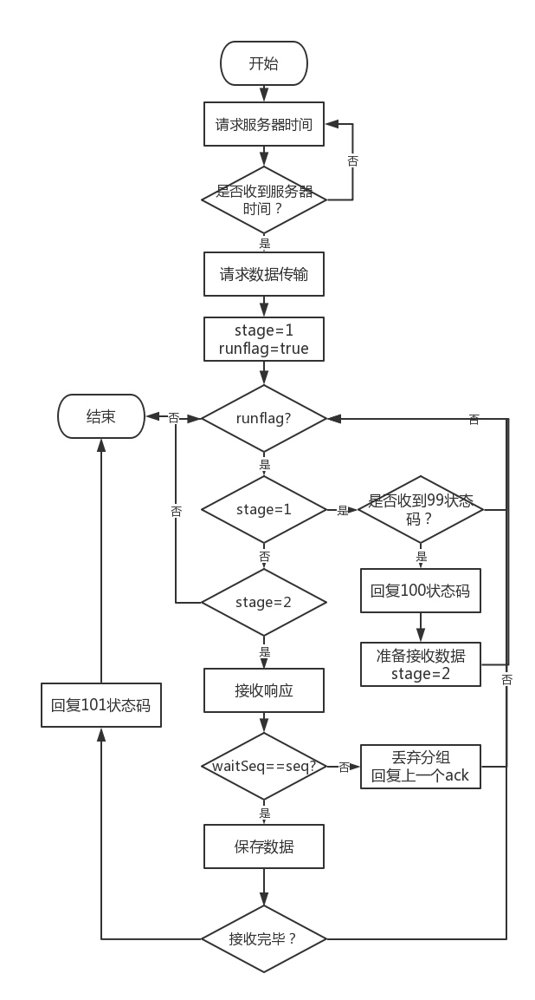
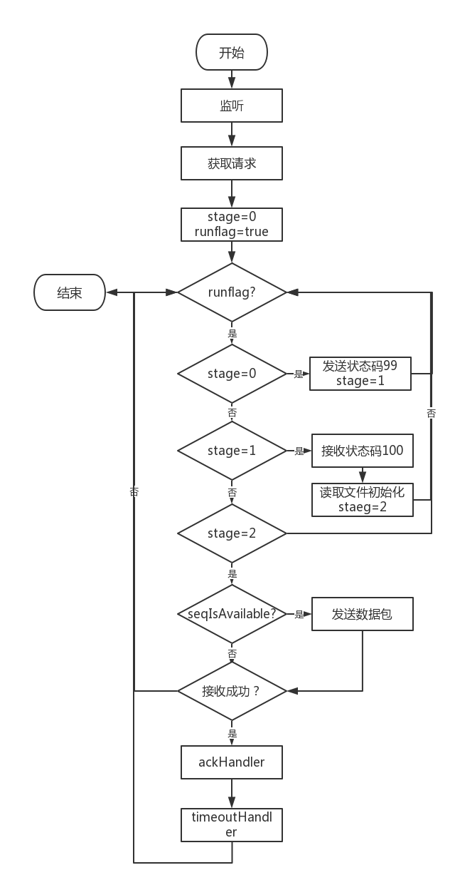

## 计算机网络相关项目

### HTTP Proxy Server
- 设计并实现一个基本 HTTP 代理服务器。要求在指定端口（例如 8080）接收来自客户的 HTTP 请求并且根据其中的 URL 地址访问该地址所指向的 HTTP 服务器（原服务器），接收 HTTP 服务器的响应报文，并 将响应报文转发给对应的客户进行浏览。 
- 设计并实现一个支持 Cache 功能的 HTTP 代理服务器。要求能缓 存原服务器响应的对象，并能够通过修改请求报文（添加 if-modified-since 头行），向原服务器确认缓存对象是否是最新版本。 
- 扩展 HTTP 代理服务器，支持如下功能： 
    + 网站过滤：允许/不允许访问某些网站； 
    + 用户过滤：支持/不支持某些用户访问外部网站； 
    + 网站引导：将用户对某个网站的访问引导至一个模拟网站（钓鱼）。

### SR Protocol
实现了SR双向传输协议。  
客户端和服务器端实现流程：

    
    

### TCP Against UDP
实现TCP和UDP的竞争，使用pyshark进行流量监控并可视化（详见[TCPUDP竞争实验报告](TCP_Against_UDP/TCPUDP竞争实验报告.docx)）。
